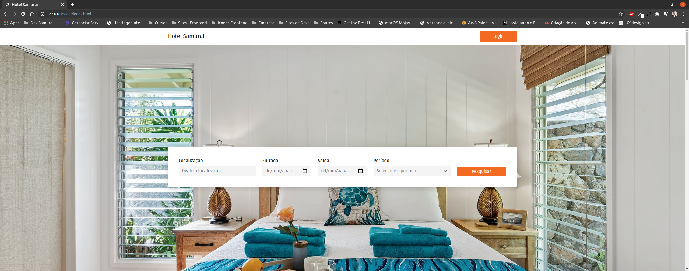
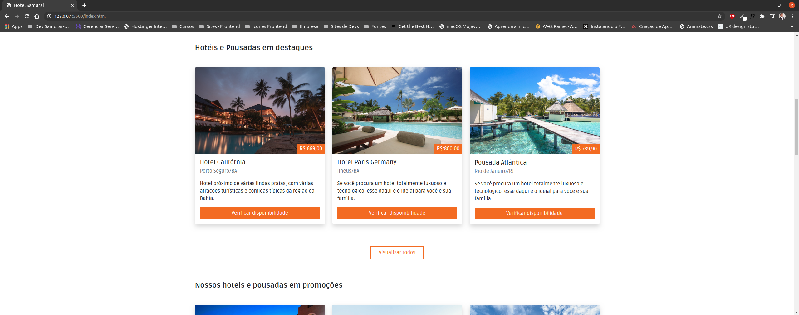
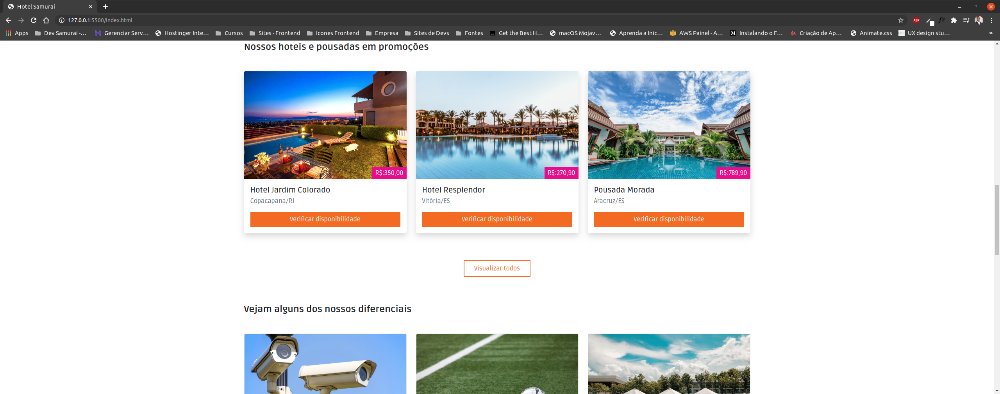
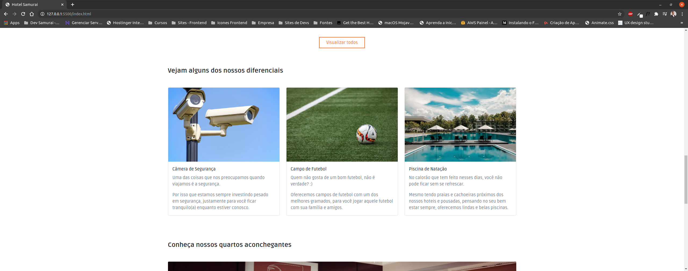
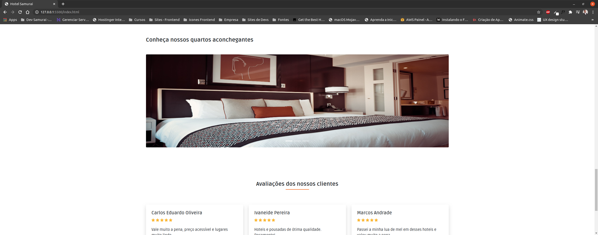
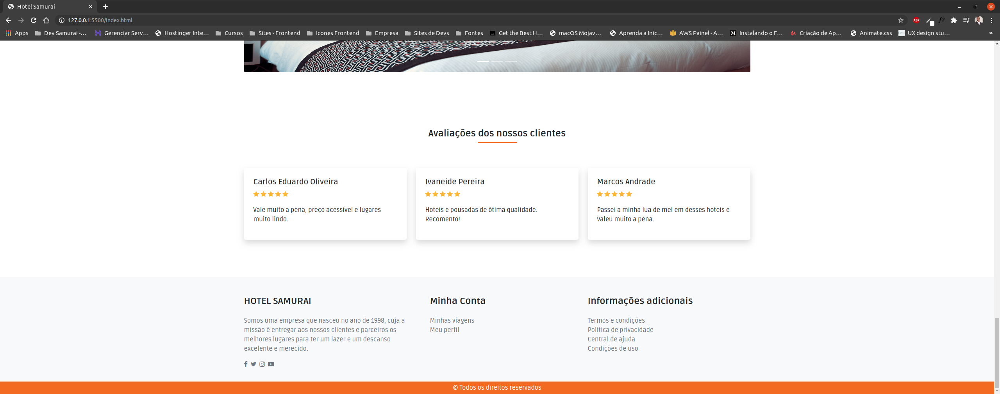
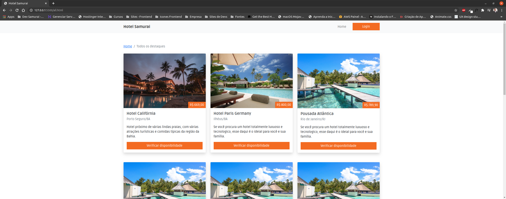

# Hotel Samurai

Olá, tudo bem?

Fico agradecido e feliz por você está por aqui vendo um dos meus projetos.

Segue abaixo mais detalhes do mesmo.

## Sobre o projeto

Esse é um projeto totalmente focado para os alunos do curso de Front end Master da Dev Samurai.

Caso tenha interesse em conhecer, o link é este aqui: [https://devsamurai.com.br](https://devsamurai.com.br)

A ideia do projeto é de desenvolver uma aplicação (template) totalmente focada em empresas de turismos, ou seja, que forneçam opções de hospedagem para o usuário final.

Nessa aplicação é possível que a empresa cadastre por exemplos, os seus hotéis e pousadas, e o cliente através dessa plataforma irá poder fazer uma pesquisa das melhores opções levando em consideração os benefícios de cada uma delas como também, o preço a se pagar.

As tecnologias que estão sendo usadas neste projeto são:

1. Bootstrap (V5).
2. CSS.
3. JavaScript.

Segue abaixo alguns screenshots do projeto:

## Status/Andamento

Em desenvolvimento.

## Observações importantes

Caso queira clonar o repositório ou utilizar em algum projeto pessoal, por favor, dá os devidos créditos. 

Ficarei muito grato! :D

## Contato

E-mail: carlos.contato00@gmail.com

Website: [https://carloseduardo.dev](https://carloseduardo.dev)

Atenciosamente,

Cadu.