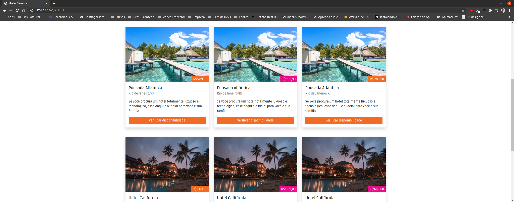

A ideia do projeto é de desenvolver uma aplicação (template) totalmente focada em empresas de turismos, ou seja, que forneçam opções de hospedagem para o usuário final.

Nessa aplicação é possível que a empresa cadastre por exemplos, os seus hotéis e pousadas, e o cliente através dessa plataforma irá poder fazer uma pesquisa das melhores opções levando em consideração os benefícios de cada uma delas como também, o preço a se pagar.

As tecnologias que estão sendo usadas neste projeto são:

1. Bootstrap (V5).
2. CSS.
3. JavaScript.

Segue abaixo alguns screenshots do projeto:

